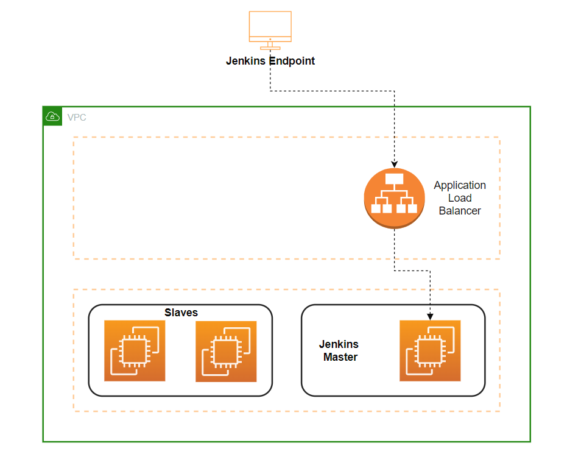

# Jenkins Infrastructure terraform

**Info**
------
This Terraform module creates a range of resources to deliver a Jenkins infrastructure including an Application Load Balancer, a Jenkins Master instance and 2 Jenkins Slave instances. 

The configuration of Jenkins Slaves is done on the Jenkins dashboard.

**Terraform compatibility**
------
Terraform Versions: 1.1.3
